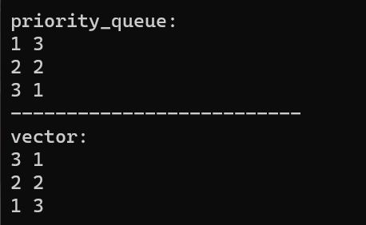
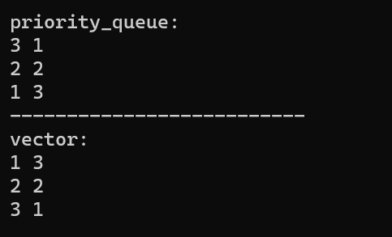

# priority_queue的排序与一般排序的区别

给定的排序规则如下：
``` python
class cmp {
public:
	bool operator()(pair<int, int> a, pair<int, int> b)
	{
		return a.second < b.second;
	}
};
```

给定`vector`与`priority_queue`
``` python
vector<pair<int, int>> array;
priority_queue<pair<int, int>, vector<pair<int, int>>,cmp> queue;
```

将数据`<1,3>`,`<2,2>`,`<3,1>`添加到`array`和`queue`中，对array调用sort函数
``` python
sort(array.begin(), array.end(),cmp());
```
在`array`中数据按照`value`值从小到大排序，而生成的`queue`却是按`value`值从大到小排序的最大堆

遍历`array`与`queue`中的数据，得到的结果为：



更改排序规则

``` python
class cmp {
public:
	bool operator()(pair<int, int> a, pair<int, int> b)
	{
		return a.second > b.second;
	}
};
```
更改后重新遍历`array`和`queue`，得到结果如下：



### 总结：priority_queue和sort中相同的比较函数，结果相反。当返回结果为`true`时，若第一个参数小于第二个参数,则sort会按从小到大的顺序排序，priority_queue会生成一个从大到小的最大堆。
